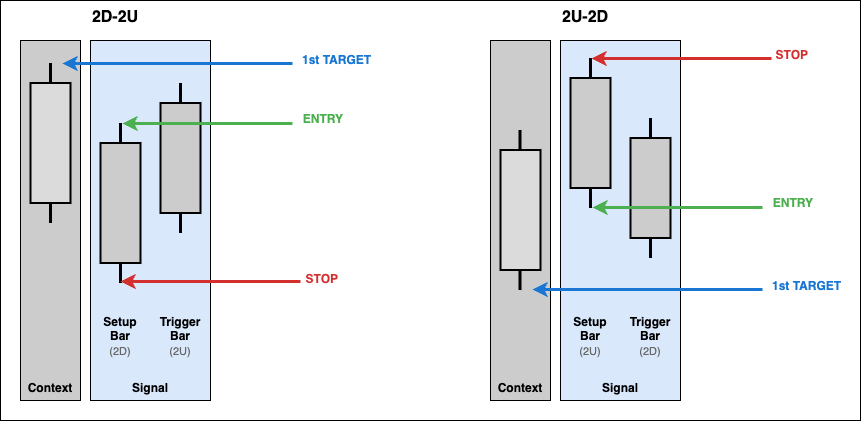

# Pattern Terminology and Visual Guide

This guide establishes clear terminology for TheStrat patterns and provides visual diagrams for all reversal and continuation signals.

## Core Terminology

### Scenarios

TheStrat classifies individual bars based on their relationship to the previous bar:

**Scenario "1" - Inside Bar**
- Current bar's high ≤ previous bar's high AND low ≥ previous bar's low
- Consolidation/consolidation - bar is completely contained within previous bar's range
- Creates potential for breakout in either direction

**Scenario "2U" - Directional Up**
- Current bar makes a higher high but doesn't make a lower low
- Upward directional move
- Labeled "2U" in pattern names

**Scenario "2D" - Directional Down**
- Current bar makes a lower low but doesn't make a higher high
- Downward directional move
- Labeled "2D" in pattern names

**Scenario "3" - Outside Bar (Expansion or Broadening formation on a lower timeframe)**
- Current bar makes both a higher high AND lower low
- Expansion - completely engulfs previous bar's range
- Labeled "3" in pattern names

All TheStrat patterns are built from combinations of these scenarios (e.g., "2D-2U", "2D-1-2U", "3-2U").

### Bar Roles

**Setup Bar**

- The bar being broken (reversals) or continued (continuations)
- Provides the entry and stop price levels
- **Always the bar immediately before the trigger bar** (regardless of pattern type)
- In 2-bar patterns (e.g., 2D-2U): The first directional bar (2D)
- In 3-bar patterns (e.g., 2D-1-2U): The inside bar (1)

**Trigger Bar**

- The bar that completes and confirms the pattern
- Where the signal is detected in the DataFrame
- **Always the final bar of the pattern** (regardless of pattern type)
- In 2-bar patterns (e.g., 2D-2U): The second directional bar (2U)
- In 3-bar patterns (e.g., 2D-1-2U): The final directional bar (2U)

### Price Levels

**Entry Price**

- Breakout/breakdown level from setup bar
- **Long signals:** Setup bar high (breakout above)
- **Short signals:** Setup bar low (breakdown below)

**Stop Price**

- Invalidation level from setup bar
- **Long signals:** Setup bar low (invalidation if broken)
- **Short signals:** Setup bar high (invalidation if broken)

**Target Ladder**

- Series of target price levels extending to structural bounds
- Detected from historical bars before the **setup bar** (or before inside bar for 1-2-2 rev-strats)
- **Long signals:** Ascending ladder of highs (each target higher than previous) extending to `higher_high` or `lower_high` bound
- **Short signals:** Descending ladder of lows (each target lower than previous) extending to `lower_low` or `higher_low` bound
- First target must be beyond the trigger bar's price (above trigger high for long, below trigger low for short)

## Visual Pattern Guide

### Inside Bar Reversals

**Patterns:** 2d-1-2u, 2u-1-2d, 3-1-2u, 3-1-2d

- Yellow candle = Inside bar (consolidation), also the setup bar
- Setup bar provides entry/stop levels
- Targets extend from historical bars beyond trigger bar

### 2-Bar Reversals

**Patterns:** 2d-2u, 2u-2d

- Two bars form the reversal pattern
- Setup bar provides entry/stop levels
- Targets extend from historical bars beyond trigger bar

### Rev-Strat Patterns

**Patterns:** 1-3u, 1-3d, 1-2d-2u, 1-2u-2d

- Pattern starts with inside bar (1)
- Setup bar provides entry/stop levels
- Targets extend from historical bars beyond trigger bar

### 3-2 Context Reversals

**Patterns:** 3-2u, 3-2d

- Context-dependent patterns (require continuity analysis)
- Scenario 3 in one direction countered by a scenario 2 in the other
- Reversal determined by previous trend context

### Inside Bar Continuations

**Patterns:** 2u-1-2u, 2d-1-2d

- Yellow candle = Inside bar
- Green line = Entry level (setup bar high/low)
- No targets stored for continuations (trend-following)

### Pattern Anatomy Example

**Detailed 2D-2U Example** showing:

- Setup Bar (2D) provides entry at high, stop at low
- Trigger Bar (2U) completes the pattern
- Target ladder detected from historical bars
- Targets extend to higher_high bound
- Actual price levels from real market data

## Price Level Rules

### Long Reversals (e.g., 2D-2U, 2D-1-2U)

- **Entry:** Setup bar high
- **Stop:** Setup bar low
- **Targets:** Ascending ladder of historical highs extending to `higher_high` or `lower_high` bound
  - First target must be above trigger bar high
  - Each subsequent target higher than previous (ascending values: target_1 < target_2 < ...)
  - Maximum targets determined by `max_targets` config
- **Relationship:** `stop < entry` and `trigger_high < target_1 < target_2 < ... ≤ bound`

### Short Reversals (e.g., 2U-2D, 2U-1-2D)

- **Entry:** Setup bar low
- **Stop:** Setup bar high
- **Targets:** Descending ladder of historical lows extending to `lower_low` or `higher_low` bound
  - First target must be below trigger bar low
  - Each subsequent target lower than previous (descending values: target_1 > target_2 > ...)
  - Maximum targets determined by `max_targets` config
- **Relationship:** `stop > entry` and `trigger_low > target_1 > target_2 > ... ≥ bound`

### Continuations (All patterns)

- **Entry:** Setup bar high (long) or low (short)
- **Stop:** Setup bar low (long) or high (short)
- **Targets:** None (trend-following, no target ladder)

## All Pattern Names Reference

### Reversal Patterns - Long Bias

**2-Bar Patterns:**

- `2D-2U` - Down bar followed by up bar (simple reversal)
- `3-2U` - Outside bar followed by a reversal in the opposite direction.

**3-Bar Patterns:**

- `1-2D-2U` - Inside, down, up (Rev Strat)
- `3-1-2U` - Outside, inside, up
- `3-2D-2U` - Outside, down, up
- `2D-1-2U` - Down, inside, up

### Reversal Patterns - Short Bias

**2-Bar Patterns:**

- `2U-2D` - Up bar followed by down bar (simple reversal)
- `3-2D` - Outside bar followed by a reversal in the opposite direction.

**3-Bar Patterns:**

- `1-2U-2D` - Inside, up, down (Rev Strat)
- `3-1-2D` - Outside, inside, down
- `3-2U-2D` - Outside, up, down
- `2U-1-2D` - Up, inside, down

### Continuation Patterns - Long Bias

**2-Bar Patterns:**

- `2U-2U` - Up bar followed by up bar (continuation)

**3-Bar Patterns:**

- `2U-1-2U` - Up, inside, up

### Continuation Patterns - Short Bias

**2-Bar Patterns:**

- `2D-2D` - Down bar followed by down bar (continuation)

**3-Bar Patterns:**

- `2D-1-2D` - Down, inside, down

## Implementation Reference

### Code Locations

**Signal Detection:** `thestrat/indicators.py`

**Signal Objects:** `thestrat/signals.py`

**Configuration:** `thestrat/schemas.py`

## Related Documentation

- [Signal Metadata Guide](signal-metadata.md) - Complete field documentation
- [DataFrame Schema](dataframe-schema.md) - Output column specifications
- [Asset Classes](asset-classes.md) - Timezone and session configuration
- [Examples](examples.md) - Real-world usage examples
